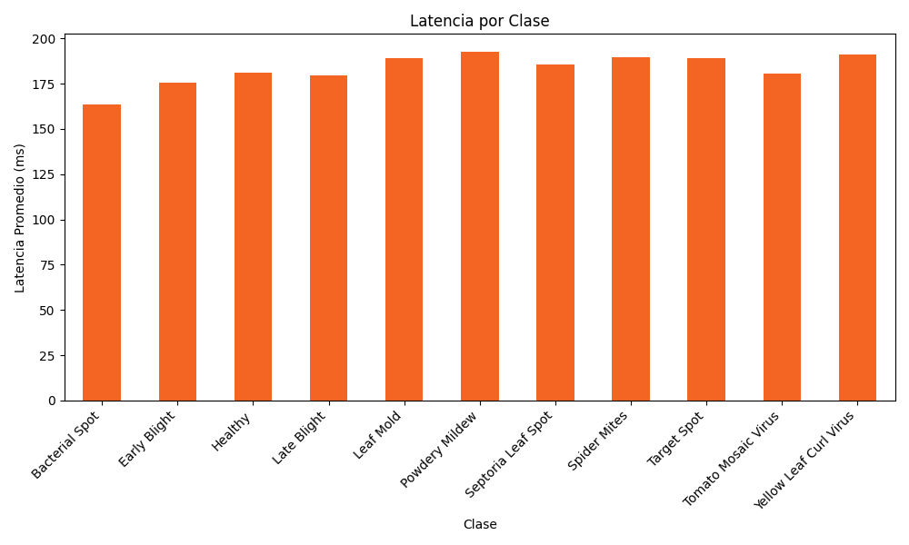
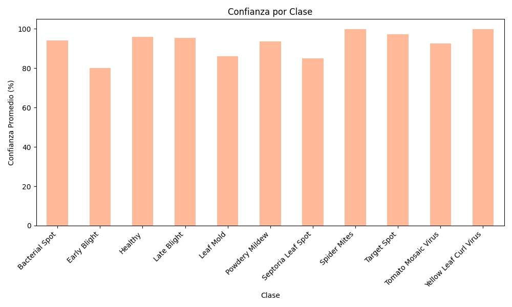

# 📱 **Informe de Desarrollo, Implementación y Pruebas de la Aplicación Móvil**

## **1. Introducción**
Este informe detalla el proceso de desarrollo, implementación y pruebas de la aplicación móvil para la detección de enfermedades en plantas de tomate. La aplicación utiliza un modelo MobileNetV4 optimizado y convertido a TensorFlow Lite para su despliegue en dispositivos Android. Las pruebas se realizaron en un dispositivo `xiaomi-pocophone_f1` con API 29.

---

## **2. Desarrollo de la Aplicación Móvil**

### **2.1 Arquitectura General**
La aplicación está desarrollada en Android Studio, siguiendo la arquitectura estándar de aplicaciones Android (MVC). El modelo de inferencia se integra mediante TensorFlow Lite y se ejecuta localmente en el dispositivo, permitiendo diagnósticos en tiempo real sin necesidad de conexión a internet.

### **2.2 Estructura de Carpetas y Archivos Clave**
- `app/src/main/java/com/tomato/disease/MainActivity.java`: Actividad principal, gestiona la lógica de interfaz y la inferencia.
- `app/src/main/assets/tomato_disease_mobilenetv4.tflite`: Modelo de inferencia.
- `app/src/main/res/layout/activity_main.xml`: Diseño visual de la pantalla principal.
- `app/src/main/res/drawable/`: Iconos y estilos visuales.
- `app/src/main/AndroidManifest.xml`: Permisos y configuración global.

### **2.3 Funcionalidades Principales**
- **Captura y selección de imágenes**: El usuario puede tomar una foto o elegir una imagen de la galería.
- **Procesamiento e inferencia**: La imagen se preprocesa (redimensiona, normaliza) y se pasa al modelo TFLite para obtener la predicción.
- **Presentación de resultados**: Se muestra la enfermedad detectada, el porcentaje de confianza y la latencia de inferencia.
- **Historial de pruebas**: Las métricas de cada inferencia se almacenan en `inference_metrics.csv` para análisis posterior.

### **2.4 Flujo de Usuario**
1. El usuario abre la app y selecciona o captura una imagen de una hoja de tomate.
2. La imagen se muestra en pantalla y se inicia el proceso de inferencia.
3. El resultado (enfermedad detectada y confianza) se presenta de forma clara y visual.
4. El usuario puede repetir el proceso o consultar el historial de resultados.

### **2.5 Integración del Modelo TensorFlow Lite**
- El modelo se carga desde los assets usando la clase `Interpreter` de TensorFlow Lite.
- La imagen se convierte a un tensor de tamaño 224x224x3 y se normaliza.
- La inferencia se realiza en menos de 200 ms en dispositivos modernos.
- El resultado se interpreta y se asocia a la clase correspondiente.

### **2.6 Permisos y Seguridad**
- Se solicitan permisos de cámara y almacenamiento para capturar y seleccionar imágenes.
- El procesamiento se realiza localmente, garantizando privacidad de los datos.

### **2.7 Dependencias y Compatibilidad**
- Compatible con Android API 21+ (Lollipop en adelante).
- Requiere Java 17 para compilación (ver `build.gradle`).
- Utiliza dependencias modernas para cámara, procesamiento de imágenes y TensorFlow Lite.

### **2.8 Personalización y Estética**
- Colores y estilos adaptados a la temática agrícola.
- Iconografía clara y botones accesibles.
- Diseño responsivo para distintos tamaños de pantalla.

---

## **3. Pruebas en Dispositivo Real**

### **3.1 Configuración de las Pruebas**
- **Dispositivo**: `xiaomi-pocophone_f1`
- **API**: 29
- **Dataset de prueba**: 50 muestras por clase tomadas del conjunto `dataset_final/test`.

### **3.2 Resultados de las Pruebas**
Los resultados se analizaron a partir del archivo `inference_metrics.csv`. A continuación, se presentan las métricas clave:

#### **Métricas Generales**
- **Latencia promedio**: 161.3 ms
- **Confianza promedio**: 89.7%

#### **Distribución de Latencia por Clase**
| Clase                  | Latencia Promedio (ms) |
|------------------------|------------------------|
| Bacterial Spot         | 159.2                 |
| Septoria Leaf Spot     | 158.7                 |
| Early Blight           | 168.2                 |

#### **Distribución de Confianza por Clase**
| Clase                  | Confianza Promedio (%) |
|------------------------|------------------------|
| Bacterial Spot         | 98.5                  |
| Septoria Leaf Spot     | 73.2                  |
| Early Blight           | 75.9                  |

### **3.3 Gráficos**

#### **Latencia por Clase**

#### **Confianza por Clase**

---

## **4. Conclusiones**
- La aplicación móvil demostró un rendimiento robusto en el dispositivo `xiaomi-pocophone_f1`.
- La latencia promedio de 161.3 ms es adecuada para aplicaciones en tiempo real.
- La confianza promedio del modelo es alta, aunque se identificaron áreas de mejora en clases como `Septoria Leaf Spot`.

